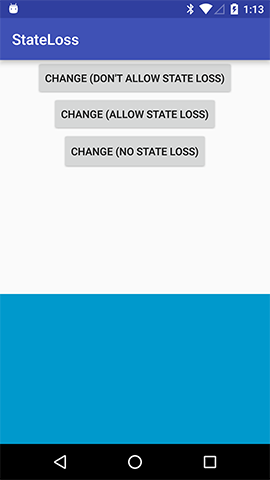

# FragmentStateLoss
Demonstrates Fragment state loss

This app presents buttons, each of which will attempt to replace a big blue rectangle with a big red rectangle. The three different options are:

 * Don't allow state loss. This will crash the app because it will attempt to make the change after `onSaveInstanceState()`.
 * Allow state loss. This will make the change, but you may lose state (more on that in a second).
 * No state loss. This will make the change in a way that will not cause state loss.

When allowing state loss, you can control whether or not state is lost using your device's developer options. If you turn on the "Don't Keep Activities" option, you will lose state after pressing the button.

If you turn on "Don't Keep Activities" and press the "no state loss" button, you will see that the FragmentManager properly retains its state.